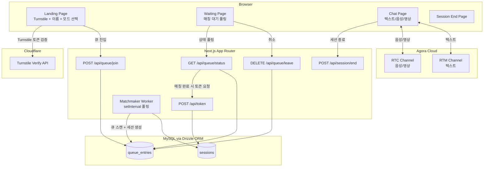
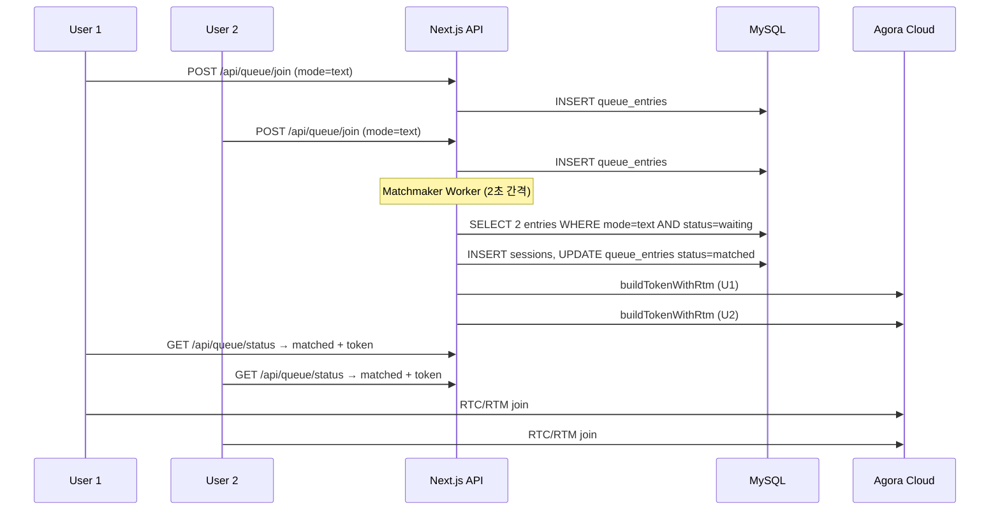

# Design Document: Random Chat App

## Overview

랜덤 채팅 앱은 사용자가 텍스트·음성·영상 중 원하는 방식을 선택해 낯선 사람과 7분간 익명으로 대화하는 서비스입니다. Next.js App Router 단일 프로젝트로 구성되며, 서버 측 매치메이킹과 세션 관리를 Route Handler로 처리하고, 실시간 통신은 Agora RTC(음성/영상) + RTM(텍스트)으로 처리합니다.

핵심 설계 결정:
- **매치메이킹**: DB 폴링 기반 서버 측 매칭 (별도 WebSocket 서버 불필요)
- **세션 타이머**: 서버가 세션 만료 시각을 DB에 기록, 클라이언트는 해당 시각까지 카운트다운
- **Agora 토큰**: 서버에서 `agora-token` 라이브러리로 생성, 10분 만료
- **RTM + RTC 동일 채널명**: 같은 채널명을 RTC와 RTM 양쪽에 사용해 라우팅 단순화

---

## Architecture



### 매치메이킹 흐름



---

## Components and Interfaces

### 페이지 컴포넌트

| 경로 | 설명 |
|------|------|
| `app/page.tsx` | 랜딩 페이지 (Turnstile + 이름 + 모드 선택) |
| `app/waiting/page.tsx` | 매칭 대기 페이지 (폴링) |
| `app/chat/[sessionId]/page.tsx` | 채팅 페이지 (텍스트/음성/영상) |
| `app/ended/page.tsx` | 세션 종료 페이지 |

### API Route Handlers

| 경로 | 메서드 | 설명 |
|------|--------|------|
| `app/api/queue/join/route.ts` | POST | Turnstile 검증 후 큐 진입 |
| `app/api/queue/leave/route.ts` | DELETE | 큐에서 이탈 |
| `app/api/queue/status/route.ts` | GET | 매칭 상태 폴링 |
| `app/api/token/route.ts` | POST | Agora RTC+RTM 토큰 발급 |
| `app/api/session/end/route.ts` | POST | 세션 수동 종료 |

### 클라이언트 컴포넌트

| 컴포넌트 | 설명 |
|----------|------|
| `components/TurnstileWidget.tsx` | Cloudflare Turnstile 위젯 래퍼 |
| `components/ChatModeSelector.tsx` | 텍스트/음성/영상 모드 선택 UI |
| `components/TextChat.tsx` | RTM 기반 텍스트 채팅 UI |
| `components/VoiceChat.tsx` | RTC 기반 음성 채팅 UI (뮤트 토글) |
| `components/VideoChat.tsx` | RTC 기반 영상 채팅 UI (뮤트 + 카메라 토글) |
| `components/SessionTimer.tsx` | 7분 카운트다운 타이머 |
| `components/AgoraProvider.tsx` | dynamic import로 SSR 우회한 Agora 프로바이더 |

### 서버 측 서비스

| 모듈 | 설명 |
|------|------|
| `lib/matchmaker.ts` | 큐 스캔 및 세션 생성 로직 |
| `lib/agora-token.ts` | `agora-token` 라이브러리 래퍼 |
| `lib/turnstile.ts` | Turnstile 서버 측 검증 |
| `lib/db/schema.ts` | Drizzle ORM 스키마 정의 |

### API 인터페이스

```typescript
// POST /api/queue/join
interface JoinQueueRequest {
  turnstileToken: string;
  userName: string;          // 1-20자
  chatMode: 'text' | 'voice' | 'video';
}
interface JoinQueueResponse {
  queueEntryId: string;
}

// GET /api/queue/status?queueEntryId=xxx
interface QueueStatusResponse {
  status: 'waiting' | 'matched' | 'cancelled';
  sessionId?: string;
  channelName?: string;
  rtcToken?: string;
  rtmToken?: string;
  rtcUid?: number;
  expiresAt?: string;        // ISO 8601, 세션 만료 시각
}

// POST /api/session/end
interface EndSessionRequest {
  sessionId: string;
  reason: 'user_left';
}
```

---

## Data Models

### Drizzle ORM 스키마

```typescript
// lib/db/schema.ts
import { mysqlTable, varchar, int, timestamp, mysqlEnum } from 'drizzle-orm/mysql-core';

export const queueEntries = mysqlTable('queue_entries', {
  id:         varchar('id', { length: 36 }).primaryKey(),          // UUID
  userName:   varchar('user_name', { length: 20 }).notNull(),
  chatMode:   mysqlEnum('chat_mode', ['text', 'voice', 'video']).notNull(),
  status:     mysqlEnum('status', ['waiting', 'matched', 'cancelled']).notNull().default('waiting'),
  sessionId:  varchar('session_id', { length: 36 }),               // 매칭 후 채워짐
  createdAt:  timestamp('created_at').defaultNow().notNull(),
  updatedAt:  timestamp('updated_at').defaultNow().onUpdateNow().notNull(),
});

export const sessions = mysqlTable('sessions', {
  id:               varchar('id', { length: 36 }).primaryKey(),    // UUID = Agora 채널명
  chatMode:         mysqlEnum('chat_mode', ['text', 'voice', 'video']).notNull(),
  user1Name:        varchar('user1_name', { length: 20 }).notNull(),
  user2Name:        varchar('user2_name', { length: 20 }).notNull(),
  user1QueueId:     varchar('user1_queue_id', { length: 36 }).notNull(),
  user2QueueId:     varchar('user2_queue_id', { length: 36 }).notNull(),
  startedAt:        timestamp('started_at').defaultNow().notNull(),
  expiresAt:        timestamp('expires_at').notNull(),             // startedAt + 420초
  endedAt:          timestamp('ended_at'),
  terminationReason: mysqlEnum('termination_reason', ['timer_expired', 'user_left']),
});
```

### 세션 ID = Agora 채널명

`sessions.id`는 UUID v4로 생성되며, 이 값을 그대로 Agora RTC 채널명과 RTM 채널명으로 사용합니다. 별도 채널명 생성 로직이 필요 없고, DB 조회만으로 채널을 특정할 수 있습니다.

### 큐 항목 생명주기

```
waiting → matched (Matchmaker가 세션 생성 시)
waiting → cancelled (사용자가 취소 시)
```

---

## Correctness Properties

*A property is a characteristic or behavior that should hold true across all valid executions of a system — essentially, a formal statement about what the system should do. Properties serve as the bridge between human-readable specifications and machine-verifiable correctness guarantees.*

### Property 1: 이름 유효성 검사

*For any* 문자열 입력에 대해, 길이가 1~20자인 경우 유효한 이름으로 수락되어야 하고, 빈 문자열·공백만으로 구성된 문자열·21자 이상의 문자열은 거부되어야 한다.

**Validates: Requirements 1.4, 1.5**

---

### Property 2: 채팅 모드 단일 선택 불변식

*For any* 모드 선택 시퀀스에 대해, 마지막으로 선택된 모드만 활성화(highlighted) 상태여야 하며, 나머지 두 모드는 비활성화 상태여야 한다.

**Validates: Requirements 2.2**

---

### Property 3: 미디어 권한 요청 조건

*For any* 채팅 모드 선택에 대해, voice 또는 video 모드를 선택하고 매치메이킹을 시작할 때는 반드시 미디어 권한 요청이 발생해야 하고, text 모드에서는 권한 요청이 발생하지 않아야 한다.

**Validates: Requirements 2.4**

---

### Property 4: 큐 진입 모드 일치

*For any* 사용자와 채팅 모드에 대해, 해당 모드로 큐에 진입하면 DB의 queue_entries 테이블에서 해당 사용자의 레코드는 동일한 chat_mode 값을 가져야 한다.

**Validates: Requirements 3.1**

---

### Property 5: 매칭 모드 동일성 불변식

*For any* 생성된 세션에 대해, 세션에 연결된 두 사용자의 chat_mode는 반드시 동일해야 한다.

**Validates: Requirements 3.2**

---

### Property 6: 매칭 후 큐 제거 라운드트립

*For any* 동일 모드의 두 사용자가 큐에 진입한 경우, Matchmaker가 세션을 생성한 후 두 사용자의 queue_entries 상태는 'matched'로 변경되어야 하고, 'waiting' 상태의 큐에서는 제거되어야 한다.

**Validates: Requirements 3.3**

---

### Property 7: 큐 취소 후 제거

*For any* 대기 중인 사용자가 매치메이킹을 취소하면, 해당 사용자의 queue_entries 레코드 상태는 'cancelled'로 변경되어야 하고, 이후 Matchmaker의 매칭 대상에서 제외되어야 한다.

**Validates: Requirements 3.5**

---

### Property 8: 세션 채널명 고유성

*For any* 생성된 세션들의 집합에 대해, 모든 세션의 채널명(session ID)은 서로 달라야 한다.

**Validates: Requirements 4.1**

---

### Property 9: 토큰 만료 시각

*For any* 발급된 Agora 토큰에 대해, 토큰의 만료 시각은 발급 시각으로부터 정확히 600초(10분) 후여야 한다.

**Validates: Requirements 4.3**

---

### Property 10: 메시지 렌더링 포함 정보

*For any* 전송된 텍스트 메시지에 대해, 채팅 창에 렌더링된 결과는 발신자 이름과 타임스탬프를 포함해야 한다.

**Validates: Requirements 5.2**

---

### Property 11: 메시지 길이 유효성 검사

*For any* 문자열 메시지에 대해, 길이가 1~1000자인 경우 전송이 허용되어야 하고, 1000자를 초과하는 경우 전송이 차단되어야 한다.

**Validates: Requirements 5.3, 5.4**

---

### Property 12: 음성 뮤트 라운드트립

*For any* 음성 세션에서, 뮤트 활성화 시 로컬 오디오 트랙의 enabled 상태는 false여야 하고, 뮤트 비활성화 시 enabled 상태는 true로 복원되어야 한다.

**Validates: Requirements 6.3, 6.4**

---

### Property 13: 카메라 토글 라운드트립

*For any* 영상 세션에서, 카메라 off 활성화 시 로컬 비디오 트랙의 enabled 상태는 false여야 하고, 카메라 off 비활성화 시 enabled 상태는 true로 복원되어야 한다.

**Validates: Requirements 7.4, 7.5**

---

### Property 14: 세션 타이머 초기값

*For any* 생성된 세션에 대해, expiresAt은 startedAt으로부터 정확히 420초 후여야 한다.

**Validates: Requirements 8.1**

---

### Property 15: 세션 생성 시 DB 퍼시스턴스 라운드트립

*For any* 생성된 세션에 대해, sessions 테이블을 session ID로 조회하면 session ID, chat_mode, started_at, user1_name, user2_name 필드가 모두 존재하고 올바른 값을 가져야 한다.

**Validates: Requirements 9.1**

---

### Property 16: 세션 종료 시 DB 업데이트

*For any* 종료된 세션에 대해, sessions 테이블의 해당 레코드는 ended_at과 termination_reason이 null이 아닌 값으로 업데이트되어야 한다.

**Validates: Requirements 9.2**

---

### Property 17: 큐 항목 DB 퍼시스턴스 라운드트립

*For any* 큐에 진입한 사용자에 대해, queue_entries 테이블을 조회하면 해당 사용자의 레코드가 존재하고 status가 'waiting'이어야 한다.

**Validates: Requirements 9.3**

---

## Error Handling

### Turnstile 검증 실패
- 클라이언트: 에러 메시지 표시, 폼 비활성화
- 서버: `/api/queue/join`에서 Turnstile 서버 검증 실패 시 `400 Bad Request` 반환

### 미디어 권한 거부
- 브라우저 `getUserMedia` 거부 시 `NotAllowedError` 캐치
- 에러 메시지 표시, 매치메이킹 시작 차단

### Agora 토큰 생성 실패
- `agora-token` 라이브러리 예외 발생 시 세션 레코드 삭제
- 두 사용자의 queue_entries를 'waiting'으로 롤백
- 클라이언트 폴링 응답에 `status: 'waiting'` 유지

### 세션 중 파트너 이탈
- RTM `presence` 이벤트의 `LEAVE`/`TIMEOUT`으로 감지
- 남은 사용자에게 "파트너가 나갔습니다" 알림 표시
- 세션 종료 화면으로 전환

### 토큰 만료 (10분 > 7분 세션)
- 세션이 7분이므로 10분 토큰은 세션 내에서 만료되지 않음
- 그러나 `token-privilege-will-expire` 이벤트 핸들러를 등록해 방어적으로 처리

### 네트워크 오류
- `connection-state-change` 이벤트로 RTC 연결 상태 모니터링
- RTM `status` 이벤트로 RTM 연결 상태 모니터링
- 재연결 시도 중 UI에 연결 상태 표시

---

## Testing Strategy

### 이중 테스트 접근법

단위 테스트와 속성 기반 테스트를 함께 사용합니다. 단위 테스트는 구체적인 예시와 에러 조건을 검증하고, 속성 기반 테스트는 임의의 입력에 대한 보편적 속성을 검증합니다.

**테스트 프레임워크**: Vitest  
**속성 기반 테스트 라이브러리**: `fast-check`

### 단위 테스트 대상

- Turnstile 검증 실패 시 에러 응답 반환
- 토큰 생성 실패 시 세션 롤백 및 큐 복원
- 세션 타이머 만료 시 세션 종료 화면 전환
- 파트너 이탈 시 알림 표시
- 모바일 영상 모드에서 전면 카메라 기본 선택
- 세션 종료 화면에서 새 세션 시작 옵션 표시

### 속성 기반 테스트 대상

각 속성 테스트는 최소 100회 반복 실행합니다.  
태그 형식: `Feature: random-chat-app, Property {번호}: {속성 설명}`

| 속성 | 테스트 설명 |
|------|-------------|
| Property 1 | `fast-check`로 임의 문자열 생성 → 이름 유효성 검사 함수 호출 → 길이 1-20이면 통과, 그 외 거부 |
| Property 2 | 임의 모드 선택 시퀀스 생성 → 최종 상태에서 활성 모드가 정확히 1개인지 확인 |
| Property 3 | 임의 채팅 모드 생성 → voice/video면 권한 요청 발생, text면 미발생 확인 |
| Property 4 | 임의 사용자+모드 조합 → 큐 진입 후 DB 레코드의 chat_mode 일치 확인 |
| Property 5 | 임의 세션 생성 → 두 사용자의 chat_mode 동일성 확인 |
| Property 6 | 동일 모드 두 사용자 큐 진입 → 매칭 후 queue_entries 상태 'matched' 확인 |
| Property 7 | 임의 대기 사용자 → 취소 후 queue_entries 상태 'cancelled' 및 매칭 제외 확인 |
| Property 8 | N개 세션 생성 → 모든 session ID 고유성 확인 |
| Property 9 | 임의 토큰 발급 → 만료 시각이 발급 시각 + 600초인지 확인 |
| Property 10 | 임의 메시지+발신자 → 렌더링 결과에 발신자 이름과 타임스탬프 포함 확인 |
| Property 11 | 임의 길이 문자열 → 1-1000자 허용, 1001자 이상 차단 확인 |
| Property 12 | 임의 음성 세션 → 뮤트 on/off 후 오디오 트랙 enabled 상태 라운드트립 확인 |
| Property 13 | 임의 영상 세션 → 카메라 off/on 후 비디오 트랙 enabled 상태 라운드트립 확인 |
| Property 14 | 임의 세션 생성 → expiresAt - startedAt = 420초 확인 |
| Property 15 | 임의 세션 생성 → DB 조회 시 모든 필수 필드 존재 및 값 일치 확인 |
| Property 16 | 임의 세션 종료 → DB 레코드의 ended_at, termination_reason 비null 확인 |
| Property 17 | 임의 사용자 큐 진입 → DB 조회 시 레코드 존재 및 status='waiting' 확인 |

### Agora SDK 테스트 전략

Agora SDK는 실제 네트워크 연결이 필요하므로 단위 테스트에서 모킹합니다:
- `agora-rtc-sdk-ng`와 `agora-rtm`을 vi.mock으로 모킹
- 트랙의 `setEnabled`, `play`, `close` 메서드를 스파이로 검증
- RTM 이벤트 핸들러는 직접 호출하여 동작 검증
